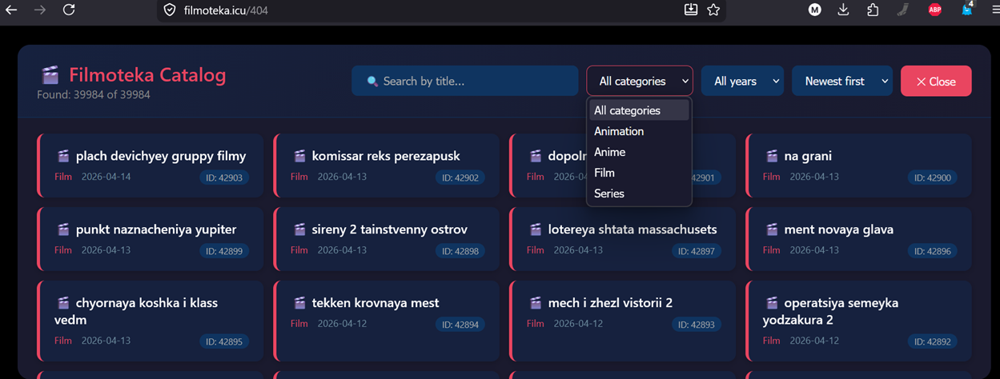
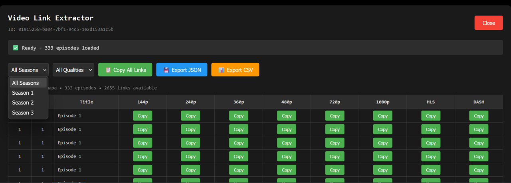
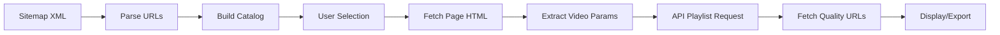

# movie-catalog-sitemap-url-parser
Parse sitemap xml and generate movie catalog with links for direct download and network watching. VK video and OK media hosting / CDN related. filmoteka.icu

# 🎬 Filmoteka Video Extractor

A browser-based JavaScript tool that creates an interactive film catalog from Filmoteka.icu sitemap and extracts video streaming links with multi-quality support.


## 📋 Overview

Filmoteka Video Extractor is a client-side bookmarklet/script that overlays a sleek catalog interface on Filmoteka.icu, allowing users to browse, search, and filter available films. When a film is selected, it automatically extracts all available video qualities (from 144p to 1080p, including HLS and DASH streams) and provides export options in multiple formats.

## ✨ Features

### Catalog Interface
- **Real-time Search** - Filter films by title as you type
- **Category Filtering** - Browse by Film, Series, Animation, or Anime
- **Year Filtering** - Filter content by release year
- **Multiple Sort Options** - Sort by newest, oldest, alphabetical, or priority
- **Responsive Grid Layout** - Clean card-based design that adapts to screen size
- **Progress Tracking** - Visual feedback during data loading

### Video Extraction
- **Multi-Quality Support** - Extract links for 144p, 240p, 360p, 480p, 720p, 1080p, HLS, and DASH
- **Season/Episode Navigation** - Filter by season for series content
- **Batch Operations** - Copy all visible links with one click
- **Export Capabilities**:
  - **JSON** - Complete data export with all metadata
  - **CSV** - Spreadsheet-friendly format for analysis
- **One-Click Copy** - Individual quality links with visual feedback

### User Experience
- **Keyboard Navigation** - Press `ESC` to close overlays
- **Visual Feedback** - Toast notifications and loading indicators
- **Dark Theme** - Eye-friendly color scheme for extended use
- **No Dependencies** - Pure vanilla JavaScript, works out of the box

### Screenshots



## 🚀 Installation

### Method 1: Bookmarklet (Recommended)

Create a new bookmark in your browser and set the URL to:

```javascript
javascript:(function(){var s=document.createElement('script');s.src='https://raw.githubusercontent.com/ZalgoSoft/movie-catalog-sitemap-url-parser/main/films.js';document.body.appendChild(s);})();
```

### Method 2: Console Execution

1. Navigate to [Filmoteka.icu](https://filmoteka.icu)
2. Open Developer Tools (`F12` or `Ctrl+Shift+I`)
3. Paste the entire script into the Console tab
4. Press `Enter` to execute

### Method 3: Local File

```bash
# Clone the repository
git clone https://github.com/ZalgoSoft/movie-catalog-sitemap-url-parser.git

# Open the project
cd filmoteka-extractor

# Copy the contents of films.js and paste into browser console
```

## 📖 Usage Guide

### Basic Workflow

1. **Launch the Extractor** - Execute the script on Filmoteka.icu
2. **Browse Catalog** - Use search, filters, and sorting to find content
3. **Select Film** - Click any film card to launch the extractor
4. **Extract Links** - Choose quality and season filters
5. **Export Data** - Copy links or export to JSON/CSV

### Keyboard Shortcuts

| Key | Action |
|-----|--------|
| `ESC` | Close current overlay |

### Filter Combinations

```
Example: Find all 2023 Anime series
1. Category Filter → "Anime"
2. Year Filter → "2023"
3. Sort → "Newest first"
```

## 🛠️ Technical Details

### Architecture

```
filmoteka-extractor/
├── films.js          # Main application script
├── README.md         # Documentation
└── LICENSE           # MIT License
```

### Data Flow



### API Endpoints Used

| Endpoint | Purpose |
|----------|---------|
| `https://filmoteka.icu/news_pages.xml` | Film catalog sitemap |
| `https://plapi.cdnvideohub.com/api/v1/player/sv/playlist` | Episode playlist data |
| `https://plapi.cdnvideohub.com/api/v1/player/sv/video/{id}` | Video quality URLs |

### Browser Compatibility

| Browser | Minimum Version |
|---------|----------------|
| Chrome | 80+ |
| Firefox | 75+ |
| Edge | 80+ |
| Safari | 13.1+ |
| Opera | 67+ |

## 📊 Export Formats

### JSON Structure

```json
{
  "title": "Film Title",
  "playlistId": "12345",
  "episodes": [
    {
      "season": 1,
      "episode": 1,
      "name": "Episode Name",
      "vkId": "67890"
    }
  ],
  "videoUrls": [
    {
      "id": "67890",
      "data": {
        "sources": {
          "mpegHighUrl": "https://...",
          "hlsUrl": "https://..."
        }
      }
    }
  ]
}
```

### CSV Structure

```csv
Season,Episode,Quality,URL
1,1,720p,https://...
1,1,1080p,https://...
1,2,720p,https://...
```

## 🔧 Customization

### Modifying Quality Labels

Edit the `QUALITY_LABELS` object in `launchVideoExtractor` function:

```javascript
const QUALITY_LABELS = {
    'mpegTinyUrl': '144p',
    'mpegLowestUrl': '240p',
    // Add custom labels here
};
```

### Changing Theme Colors

Modify the CSS variables in the style template:

```css
#film-catalog {
    background: #1a1a2e;  /* Main background */
}

.film-card {
    border-left: 4px solid #e94560;  /* Accent color */
}
```

## ⚠️ Important Notes

- **Rate Limiting** - The script makes multiple API calls; avoid excessive rapid use
- **CORS** - All requests are same-origin or to CDN endpoints with proper CORS headers
- **Session Only** - Data is not persisted between page reloads
- **Fair Use** - This tool is for personal use only; respect the website's terms of service

## 🐛 Troubleshooting

### Common Issues

| Issue | Solution |
|-------|----------|
| Script doesn't execute | Check browser console for CSP errors |
| No films appear | Verify network connection to filmoteka.icu |
| Video extraction fails | Film may be geo-restricted or removed |
| Export buttons not working | Check browser download permissions |

### Debug Mode

Add `?debug=true` to see detailed console logs:

```javascript
const DEBUG = true; // Set at top of script
```

## 🤝 Contributing

Contributions are welcome! Please follow these steps:

1. Fork the repository
2. Create a feature branch (`git checkout -b feature/amazing-feature`)
3. Commit your changes (`git commit -m 'Add amazing feature'`)
4. Push to the branch (`git push origin feature/amazing-feature`)
5. Open a Pull Request

### Development Guidelines

- Maintain vanilla JavaScript (no external dependencies)
- Follow existing code style and patterns
- Test across multiple browsers
- Update documentation for new features

## 📝 License

This project is licensed under the MIT License - see the [LICENSE](LICENSE) file for details.

## ⚖️ Disclaimer

This tool is for educational and personal use only. Users are responsible for complying with the terms of service of Filmoteka.icu and any applicable copyright laws. The developers assume no liability for misuse of this software.

## 🌟 Acknowledgments

- Filmoteka.icu for providing the content platform
- CDNVideoHub for the streaming infrastructure
- All contributors who have helped improve this tool

## 📞 Support

- **Issues**: [GitHub Issues](https://github.com/ZalgoSoft/movie-catalog-sitemap-url-parser/issues)
- **Discussions**: [GitHub Discussions](https://github.com/ZalgoSoft/movie-catalog-sitemap-url-parser/discussions)

---

**Made with ❤️ for film enthusiasts**
